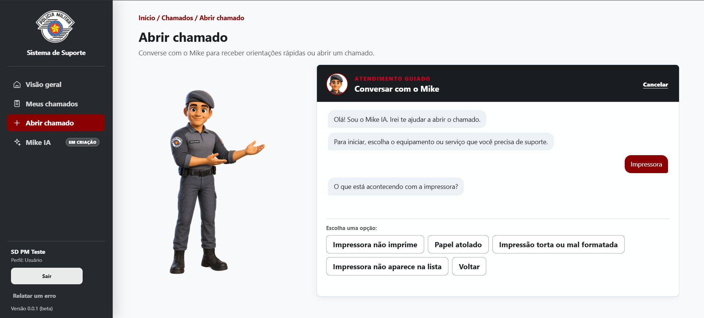
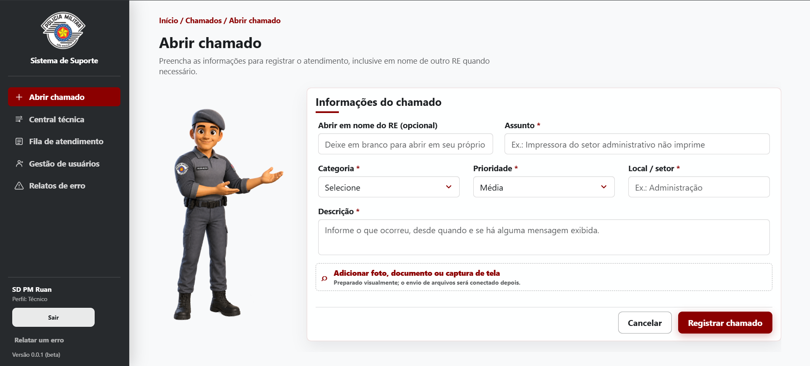
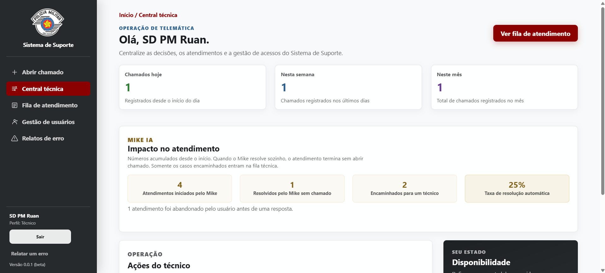
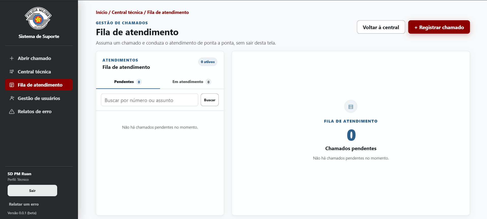
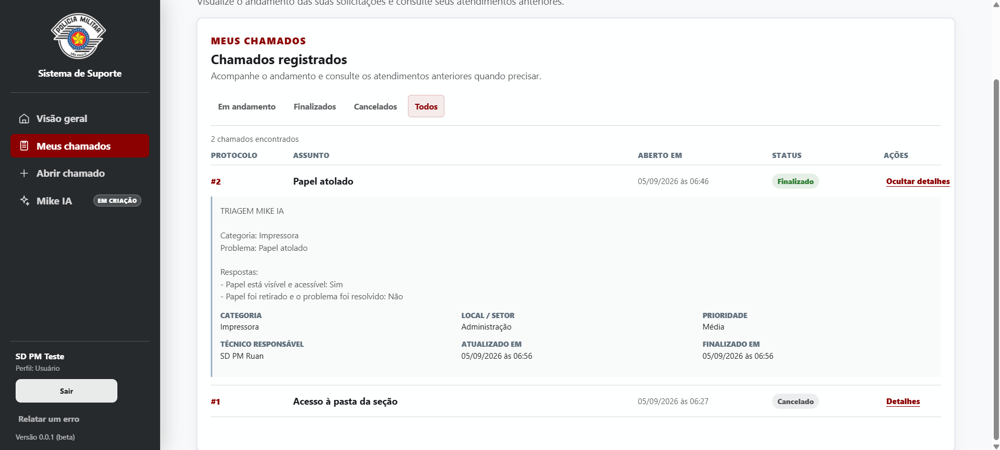

# Helpdesk Telemática - PMESP

Sistema web de helpdesk criado para centralizar solicitações de suporte, organizar a fila de atendimento e manter um histórico confiável do trabalho realizado pela equipe de Telemática.

O projeto reúne frontend e backend na mesma aplicação Spring Boot. A interface é servida pelo próprio backend, consome a API real e utiliza PostgreSQL como banco principal. Esta é uma versão de estudo e portfólio, ainda identificada como beta, construída a partir de situações comuns da rotina de suporte técnico.

## Interface

| Atendimento guiado ao usuário | Abertura direta pelo técnico |
| --- | --- |
|  |  |

| Central técnica | Fila de atendimento |
| --- | --- |
|  |  |

### Acompanhamento do usuário



## Problema que o sistema resolve

| Situação | Como o Helpdesk ajuda |
| --- | --- |
| Pedidos recebidos por telefone, mensagem ou conversa | Cada solicitação fica registrada em um único lugar. |
| Dificuldade para escolher o próximo atendimento | A fila ordena chamados por prioridade e, em caso de empate, pelo mais antigo. |
| Falta de acompanhamento pelo solicitante | O usuário consulta seus chamados, o estado atual e os detalhes do atendimento. |
| Histórico perdido após a solução | Chamados finalizados e cancelados permanecem disponíveis para consulta. |
| Poucos dados para organizar o setor | A Central Técnica apresenta indicadores de chamados e do atendimento guiado. |
| Erros encontrados durante o período beta | Qualquer pessoa autenticada pode enviar um relato estruturado para a equipe técnica. |

## Funcionalidades implementadas

### Para o usuário

- Login por RE e senha, com sessão de até duas horas.
- Primeiro acesso com RE/RE e troca obrigatória por uma senha pessoal.
- Triagem guiada do Mike antes da abertura do chamado.
- Orientações por categoria e problema, apresentadas uma etapa por vez.
- Encerramento do atendimento sem chamado quando a orientação resolve o problema.
- Formulário final de abertura quando o caso precisa ser encaminhado à equipe técnica.
- Consulta dos próprios chamados, incluindo situação, técnico responsável e solução registrada.
- Cancelamento de chamado aberto com motivo obrigatório.
- Indicação resumida de chamado na fila ou em atendimento.
- Relato de erros da aplicação por categorias predefinidas e campo de observação.

### Para o técnico

- Central Técnica com totais do dia, da semana e do mês.
- Indicadores de atendimentos iniciados, resolvidos, encaminhados e abandonados pelo Mike.
- Registro direto de chamado, inclusive em nome de outro RE.
- Fila separada entre chamados pendentes e em atendimento.
- Busca por protocolo ou assunto.
- Início, transferência, finalização e cancelamento de atendimento.
- Registro opcional da solução utilizada ao finalizar.
- Consulta do diagnóstico feito pelo Mike antes do encaminhamento.
- Alteração de prioridade pela API.
- Cadastro, consulta, atualização, inativação e reset de senha de usuários.
- Cadastro de técnicos e controle manual de disponibilidade.
- Consulta dos relatos de erro enviados pelos usuários.

### Regras de negócio importantes

- O chamado só é criado depois do envio do formulário final; navegar pela triagem não cria registros incompletos na fila.
- A fila aceita apenas chamados `ABERTO` e segue a ordem `URGENTE`, `ALTA`, `MEDIA` e `BAIXA`.
- Dentro da mesma prioridade, o chamado mais antigo aparece primeiro.
- Um chamado precisa estar `EM_ATENDIMENTO` para ser finalizado.
- Usuários comuns só consultam e alteram os próprios chamados.
- A inativação de um usuário preserva o histórico e cancela seus chamados ainda abertos.
- Chamados não são apagados pela aplicação.
- O tipo `OUTRO` em um relato de erro exige uma descrição.

## Fluxo principal

```text
Usuário ativo -> triagem guiada do Mike
                  |
                  +-> RESOLVIDO pelo Mike -> atendimento registrado sem chamado
                  |
                  `-> formulário final -> ABERTO -> EM_ATENDIMENTO -> FECHADO
                                             |
                                             `-> CANCELADO, quando necessário

Triagem sem interação por 24 horas -> ABANDONADO
```

O Mike desta versão é um atendimento guiado por categorias, problemas e respostas predefinidas. Ele ainda não utiliza um modelo de linguagem. A integração futura com Gemini Flash será uma evolução separada, mantendo autorização e regras de negócio no backend.

## Tecnologias

- Java 26
- Spring Boot 4.1.1
- Spring Web MVC
- Spring Data JPA e Hibernate
- Spring Security com autenticação por sessão
- PostgreSQL 16
- Flyway
- H2 apenas nos testes automatizados
- Maven
- HTML, CSS e JavaScript sem framework no frontend
- JUnit, Mockito e MockMvc
- Springdoc OpenAPI / Swagger UI
- Docker Compose para o PostgreSQL local

## Arquitetura

```text
Navegador
   |
   | HTML, CSS, JavaScript + requisições HTTP
   v
Controllers REST
   |
   v
Services (regras de negócio e autorização)
   |
   v
Repositories JPA
   |
   v
PostgreSQL

Flyway -> controla a evolução do banco
Spring Security -> controla sessão e perfis
TratadorDeExcecoes -> padroniza os erros da API
```

Estrutura principal:

```text
src/main/java/pmesp/helpdesk37bpmm
├── Autenticacao
├── Chamado
├── Exception
├── MikeIA
├── RelatoErro
├── Seguranca
├── Tecnico
└── Usuario

src/main/resources
├── db/migration       # migrations V1 a V8
└── static             # frontend servido pelo Spring Boot
```

## Como executar no Windows

### Pré-requisitos

- Git
- JDK 26
- Docker Desktop com Docker Compose

### 1. Baixe o projeto

```powershell
git clone https://github.com/rcunhacapao/helpdeskPmesp.git
cd helpdeskPmesp
```

### 2. Configure o PostgreSQL

Crie um arquivo `.env` na raiz do projeto. Ele é ignorado pelo Git e deve permanecer somente na sua máquina:

```env
POSTGRES_DB=helpdesk
POSTGRES_USER=helpdesk
POSTGRES_PASSWORD=escolha_uma_senha
POSTGRES_PORT=5432
```

Suba o banco:

```powershell
docker compose up -d
docker compose ps
```

O volume `helpdesk_pg_data` mantém os dados entre reinicializações. `docker compose down` para o contêiner sem apagar o volume; use `docker compose down -v` somente quando quiser excluir definitivamente os dados locais.

### 3. Configure a aplicação

O Docker Compose lê o `.env`, mas o Spring Boot não carrega esse arquivo automaticamente. Antes de iniciar o backend no PowerShell, defina as mesmas informações como variáveis de ambiente:

```powershell
$env:DATABASE_URL = "jdbc:postgresql://localhost:5432/helpdesk"
$env:DATABASE_USERNAME = "helpdesk"
$env:DATABASE_PASSWORD = "escolha_uma_senha"
```

Se executar pelo IntelliJ IDEA, informe essas três variáveis na configuração de execução da classe `Helpdesk37bpmmApplication`.

### 4. Crie o primeiro técnico

Enquanto ainda não existir técnico no banco, também configure:

```powershell
$env:BOOTSTRAP_TECNICO_RE = "100001"
$env:BOOTSTRAP_TECNICO_NOME = "Nome do técnico"
$env:BOOTSTRAP_TECNICO_EMAIL = "tecnico@policiamilitar.sp.gov.br"
$env:BOOTSTRAP_TECNICO_SENHA = "escolha_uma_senha_forte"
$env:BOOTSTRAP_TECNICO_POSTO = "SGT_3"
```

Esse cadastro automático só acontece quando ainda não existe nenhum técnico. Depois dele, os demais usuários e técnicos são cadastrados pela própria aplicação.

### 5. Inicie o sistema

Pelo Maven Wrapper:

```powershell
.\mvnw.cmd spring-boot:run
```

Ou execute `Helpdesk37bpmmApplication` pela IDE. Depois, acesse:

- Aplicação: `http://localhost:8080/`
- Swagger UI: `http://localhost:8080/swagger-ui/index.html`

## Gerar e executar o JAR

Com as variáveis do PostgreSQL configuradas:

```powershell
.\mvnw.cmd clean package
java -jar target\helpdesk37bpmm-0.0.1-SNAPSHOT.jar
```

O `.jar` contém o backend, o frontend e as dependências de produção. O PostgreSQL continua sendo um serviço separado e precisa estar acessível quando a aplicação iniciar.

## Testes

A validação mais recente executou **55 testes, sem falhas, erros ou testes ignorados**. A suíte cobre regras de chamados, autenticação, troca e reset de senha, segurança, concorrência da fila, migrations, Mike, relatos de erro e estrutura do frontend.

Como o H2 existe somente no escopo de testes, a suíte pode ser executada sem usar os dados do PostgreSQL:

```powershell
$env:DATABASE_URL = "jdbc:h2:mem:helpdesk_test;DB_CLOSE_DELAY=-1"
$env:DATABASE_USERNAME = "sa"
$env:DATABASE_PASSWORD = ""
.\mvnw.cmd test
```

Também existe um teste JavaScript puro para o fluxo de triagem:

```powershell
npm test
```

## Rotas principais

Rotas públicas não exigem login. As demais dependem de sessão; as identificadas como técnico exigem esse perfil.

| Método | Rota | Finalidade | Acesso |
| --- | --- | --- | --- |
| `POST` | `/auth/login` | Autentica com RE e senha. | pública |
| `GET` | `/auth/sessao` | Recupera os dados da sessão atual. | logado |
| `POST` | `/auth/trocar-senha` | Define a senha pessoal quando existe troca obrigatória. | troca pendente |
| `POST` | `/logout` | Encerra e invalida a sessão. | logado |
| `POST` | `/usuarios/cadastrar` | Cadastra usuário com senha temporária igual ao RE. | técnico |
| `GET` | `/usuarios/buscar/{re}` | Busca um usuário pelo RE. | técnico |
| `PUT` | `/usuarios/atualizar-dados/{re}` | Atualiza nome e posto/graduação. | técnico |
| `PATCH` | `/usuarios/inativar/{re}` | Inativa o usuário e cancela chamados abertos. | técnico |
| `PATCH` | `/usuarios/resetar-senha/{re}` | Restaura RE/RE e exige uma nova troca. | técnico |
| `POST` | `/tecnicos/cadastrar` | Torna um usuário existente técnico. | técnico |
| `GET` | `/tecnicos` | Lista todos os técnicos. | técnico |
| `PATCH` | `/tecnicos/ficar-disponivel/{re}` | Marca o técnico como disponível. | técnico |
| `PATCH` | `/tecnicos/ficar-indisponivel/{re}` | Marca o técnico como indisponível. | técnico |
| `POST` | `/chamados/cadastrar` | Registra um chamado completo. | logado |
| `GET` | `/chamados/meus` | Lista os chamados da sessão atual. | logado |
| `GET` | `/chamados/buscar/{id}` | Busca um chamado permitido para a sessão. | logado |
| `GET` | `/chamados/fila` | Lista chamados abertos na ordem da fila. | técnico |
| `GET` | `/chamados/em-atendimento` | Lista chamados já assumidos. | técnico |
| `GET` | `/chamados/resumo` | Retorna totais do dia, da semana e do mês. | técnico |
| `PUT` | `/chamados/atualizar-dados/{id}?prioridade=ALTA` | Altera a prioridade. | técnico |
| `PATCH` | `/chamados/iniciar-atendimento/{id}?reTecnico={re}` | Assume o chamado. | técnico |
| `PATCH` | `/chamados/transferir-responsavel/{id}?reTecnico={re}` | Transfere para outro técnico. | técnico |
| `PATCH` | `/chamados/finalizar/{id}?solucao={texto}` | Finaliza e registra a solução opcional. | técnico |
| `PATCH` | `/chamados/cancelar/{id}?motivoCancelamento={motivo}` | Cancela um chamado aberto. | logado |
| `POST` | `/mike-ia/iniciar` | Inicia a triagem sem criar chamado. | usuário |
| `GET` | `/mike-ia/em-diagnostico` | Recupera a triagem em andamento. | usuário |
| `PATCH` | `/mike-ia/concluir/{atendimentoId}` | Registra uma resolução sem chamado. | usuário |
| `PATCH` | `/mike-ia/encaminhar/{atendimentoId}` | Cria chamado após o formulário final. | usuário |
| `PATCH` | `/mike-ia/abandonar/{atendimentoId}` | Registra abandono da triagem. | usuário |
| `GET` | `/mike-ia/chamado/{chamadoId}` | Consulta o histórico da triagem. | técnico |
| `GET` | `/mike-ia/metricas` | Consulta os indicadores do Mike. | técnico |
| `POST` | `/relatos-erro` | Registra um erro encontrado na aplicação. | logado |
| `GET` | `/relatos-erro` | Lista os relatos recebidos. | técnico |

## Segurança e integridade

- Senhas armazenadas com BCrypt; o RE usado no primeiro acesso também é persistido apenas como hash.
- Autorização por perfil aplicada no backend, independentemente do que a interface exibe.
- Sessão invalidada no logout.
- Troca obrigatória impede o acesso às demais APIs até a criação da senha pessoal.
- DTOs com validação de entrada.
- Respostas de erro padronizadas.
- Migrations versionadas pelo Flyway.
- Controle de concorrência ao assumir chamados da fila.
- Dados sensíveis, `.env`, bancos locais e artefatos de build ignorados pelo Git.

## Limites da versão beta

- O Mike usa um roteiro guiado local; a integração com Gemini Flash ainda não foi iniciada.
- A área de anexos está preparada visualmente, mas o envio de arquivos ainda não está conectado.
- Relatórios analíticos avançados ainda serão desenvolvidos.
- Antes de uso real na intranet, ainda serão definidas as configurações finais de servidor, backup, credenciais e operação.

## Próximas etapas

1. Integrar o Mike a um modelo Gemini Flash por meio de ferramentas controladas pelo backend.
2. Criar filtros por status, prioridade, categoria e período.
3. Implementar relatórios de volume, tempo médio e problemas recorrentes.
4. Conectar o envio de anexos aos chamados.
5. Preparar a instalação e a operação da versão destinada à intranet.

## Identidade visual

| Elemento | Cor |
| --- | --- |
| Menu lateral e navegação | `#1A1D20` |
| Fundo principal | `#F8F9FA` |
| Cards | `#FFFFFF` |
| Ações principais | `#8B0000` |
| Alertas e urgências | `#DC3545` |
| Informação e andamento | `#2D5F8B` |
| Destaques do Mike | `#C79A32` |

---

Projeto pessoal de estudo e portfólio, desenvolvido de forma incremental para representar uma solução real de suporte técnico.
